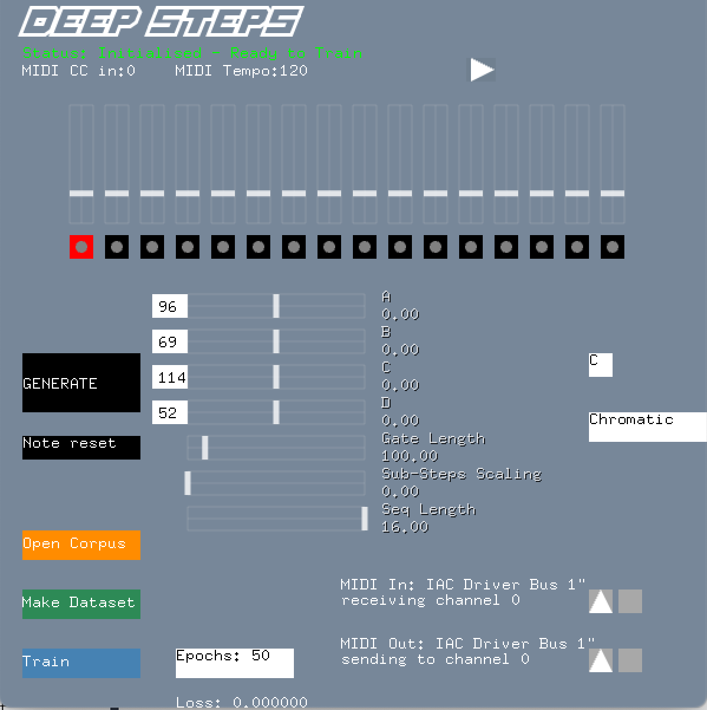

# DeepSteps

A stand alone MIDI step sequencer application with an integrated, user-trainable generative neural network.

It was created by Alex Wasatnidge as part of their Master's thesis for the Music, Communication and Technology programme at the University of Oslo.

## Description
Deep Steps is a generative MIDI step sequencer. Integrated is a generative neural network which the user can train on their own set of audio loops for generating rhythmic note on/off and sub-step “groove”.

You can read a more detailed blog post about Deep Steps [here](https://mct-master.github.io/masters-thesis/2024/05/14/alexanjw-DeepSteps.html)

## Dependencies

- [openFrameworks](https://openframeworks.cc) is a C++ creative coding toolkit
- [ofxMIDI](https://github.com/danomatika/ofxMidi) is an openFrameworks add-on which adds MIDI in and out to an openFrameworks application
- [Pure Data](https://puredata.info) is a real-time visual programming language for sound, music and multimedia
- [ofxPd](https://github.com/danomatika/ofxPd) is an openFrameworks add-on which allows the embedding of Pure Data patches in an openFrameworks application
- [aubio](https://aubio.org) is a C++ and Python library for audio analysis
- [Python](https://www.python.org) is a text-based programming language
- [Python-osc](https://pypi.org/project/python-osc/) is a small Python library for communication using the Open Sound Protocol (OSC)

## Installation
Included is the Xcode project for compiling for macOS.  To build it yourself you will need to use the correct version of openFrameworks for your OS with the remaining add-ons and libraries listed in the dependencies.  In Xcode you can use the C++ frameworks for Python and aubio.  For other platforms you will have to link the libraries yourself.  Python is embedded using the 'Very High Level Embedding' described [here](https://docs.python.org/3/extending/embedding.html#) though the interpreter can be run from anywhere.

